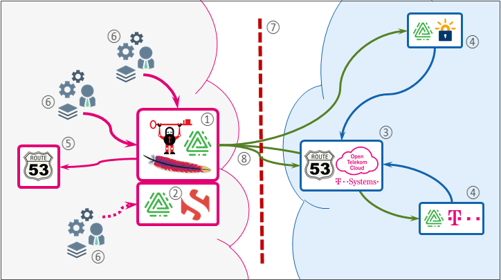

## Intro

Today [X.509][1] based [TLS][0] aka X5C is a crucial part of infrastructure also in popular HTTPS based microService architectures. Since a couple of years there is [ACME][3]. A standard to drive X5C automation. Established for the internet by [Let's Encrypt][4]. The well-known public ACME CA today.

But it's still not continuously integrated into current IT architectures. In best case the usual integration today is a running ACME client on each TLS consuming system bound to a (public) ACME CA like Let's Encrypt. This pattern includes drawbacks for air gapped large enterprises. Each system needs outbound HTTPS connectivity to the ACME CA. And utilizing a CA which requires authentication, their credentials needs to be spread across all systems.

Here DNS3L comes in place. It's a kind of a centralized [ACME client][5] that supports public ACME CA as well as [internal ACME CA][6] in case your treat model is sensitive regarding [Certificate Transparency][7] Logs. If not you can serendipitously use X5C from public CA without pain beyond the air gap.

[0]: https://wikipedia.org/wiki/Transport_Layer_Security
[1]: https://wikipedia.org/wiki/X.509
[2]: https://datatracker.ietf.org/doc/html/rfc8555
[3]: https://wikipedia.org/wiki/Automatic_Certificate_Management_Environment
[4]: https://letsencrypt.org/
[5]: https://certbot.eff.org/
[6]: https://smallstep.com/docs/step-ca
[7]: https://wikipedia.org/wiki/Certificate_Transparency



1. DNS3L | Certbot ACME client
2. private ACME CA
3. public DNS service
4. public ACME CA
5. internal DNS service
6. your apps and services
7. air gap
8. HTTPS outbound only

## Towards DNS

(Public) DNS must be used for **ACME DNS-01** validation. And the `CommonName` of your certificate should have a proper `A` or `CNAME`. **AutoDNS** is the DNS3L feature that tries to simplifies the last part.

DNS3L provides and utilizes a pluggable DNS library to handle the manifold DNS backends in the field and tries to support initially:

* [Open Telekom Cloud (OTC)][10]
* [Infoblox][13]

[10]: https://docs.otc.t-systems.com/dns/
[11]: https://desec.io/
[12]: https://doc.powerdns.com/authoritative/
[13]: https://www.infoblox.com/products/ddi/

## Towards DNS-01

The `dns3ld` guys using [LEGO][30] as ACME client lib. Some air gap scenarios doesn't provide outbound public DNS access required by LEGOs preflight checking.
TODO: Talk a bit about the solution we implemented...

[30]: https://github.com/go-acme/lego

## Towards Auth

The software usually runs beyond the Iron Curtain inside the enterprise. Actually we are integrating [Dex][21] OIDCP as auth backend to address modern OAuth2/OIDC patterns and to inject Active Directory/LDAP group memberships into OIDC JWS ID tokens `groups[]` scope. Other enterprise IDM backends than Active Directory/LDAP like GitLab, Atlassian, ... are supported by [Dex][21]. Local user management is (unfortunately) not supported by [Dex][21].

**Authentication** is done by the client. The client acquires an OIDC ID token from the auth backend. Our web app is using the usual [Authorization Code][22] Grant flow. DevOps CLI tools can utilize the [Resource Owner Password Credentials][23] Grant flow:

[21]: https://dexidp.io/
[22]: https://tools.ietf.org/html/rfc6749#section-4.1
[23]: https://tools.ietf.org/html/rfc6749#section-4.3

```bash
OIDC_URL="http://localhost:5556/auth/.well-known/openid-configuration"
CLIENT_ID="id"
CLIENT_SECRET="secret"
USER="foobar"
PASS="secret"

TOKEN_URL=`curl -s "${OIDC_URL}" | jq -r .token_endpoint`

ID_TOKEN=`curl -s -X POST -u "${CLIENT_ID}:${CLIENT_SECRET}" \
  -d "grant_type=password&scope=openid profile email groups offline_access&username=${USER}&password=${PASS}" \
  ${TOKEN_URL} | jq -r .id_token`

echo ${ID_TOKEN}
```

**Authorization** is done optionally by the server. This enables multi tenant capability. The DNS3L backend receives an OIDC ID token from the client. The token is [validated][24] and based on the `groups[]` scope inside the token the server implements its authorization logic:

[24]: https://dexidp.io/docs/using-dex/#consuming-id-tokens

```json
"user": {
  "email": "kilgore@kilgore.trout",
  "email_verified": true,
  "groups": [
    "read",
    "write",
    "foo.example.com",
    "bar.example.net"
  ],
  "name": "Kilgore Trout" }
```

The main authorization logic is based on DNS root suffixes by convention. This means the user can read or manipulate everything under `.foo.example.com` and `.bar.example.net`. For example deleting `a.b.foo.example.com` or creating `x.y.bar.example.net`. Fine grained control between r/w per root zone per user is actually not supported. 

**You need to model the mapping between allowed root zones per user as groups inside your Active Directory/LDAP DIT**. Nested groups on Active Directory/LDAP level are actually not supported by Dex. A compatible model can look like this:

```ldif
dn: UID=kilgore,OU=users,DC=example,DC=com
cn: Kilgore Trout
displayName: Kilgore Trout
mail: kilgore@kilgore.trout
name: Kilgore Trout
sAMAccountName: kilgore
uid: kilgore 
memberOf: CN=read,OU=DNS3L,OU=groups,DC=example,DC=com
memberOf: CN=write,OU=DNS3L,OU=groups,DC=example,DC=com
memberOf: CN=foo.example.com,OU=DNS3L,OU=groups,DC=example,DC=com
memberOf: CN=bar.example.net,OU=DNS3L,OU=groups,DC=example,DC=com

{{#groups}}
dn: CN={{.}},OU=DNS3L,OU=groups,DC=example,DC=com
cn: {{.}}
member: UID=kilgore,OU=users,DC=example,DC=com
name: {{.}}
sAMAccountName: {{.}}
{{/groups}}
```

Privilege escalation applies if `read` and `write` are both available. A valid token defaults to `write` in case authorization is disabled. In case `email` and `name` are not set any `write` operation is denied. In case `email` is not set certificate claiming is denied.
